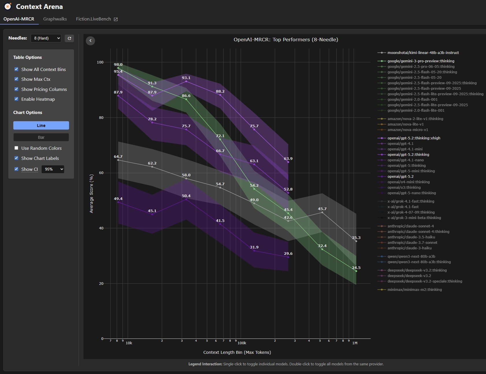

# Antigravity Memory

> Persistent memory layer for Antigravity IDE — your AI never forgets what you built.

Inspired by [Claude-Mem](https://github.com/thedotmack/claude-mem) ([docs](https://docs.claude-mem.ai/introduction)), which brings persistent memory to Claude Code. We asked: **what if Antigravity IDE users had the same superpower?** Claude-Mem works through Claude Code's lifecycle hooks — Antigravity doesn't have those yet, so we built an MCP-based approach that gives Gemini the same long-term memory through tool calls.

## The Problem

Every time you start a new chat in Antigravity IDE, Gemini has **zero memory** of your previous sessions. You waste time re-explaining your codebase, architecture decisions, and what you already built.

**Without memory:**
```
Day 1: "Build a login page" → Gemini builds it ✅
Day 2: "Add forgot password" → Gemini: "What login page?" 😤
```

**With Antigravity Memory:**
```
Day 1: "Build a login page" → Gemini builds it, memory captures it ✅
Day 2: "Add forgot password" → Gemini: "I'll add that to LoginForm.tsx
        we built yesterday, below the password field" 🧠
```

## Why This Matters — The Context Loss Problem

As your project grows, so does the context your AI needs. But research shows that **all LLMs lose accuracy as context length increases** — even models with massive context windows.


*Source: [Context Arena](https://context.ai) — OpenAI MRCR benchmark (8-needle, hard). Every model's accuracy drops as the context window fills up.*

**The key insight:** Gemini supports up to 2M tokens — the largest context window of any model. But even Gemini's accuracy drops from ~93% at 10K tokens down to ~25% at 1M tokens. Dumping your entire project history into the context window doesn't work.

**Our approach:** Instead of stuffing raw history into the prompt, Antigravity Memory **compresses and summarizes** past sessions using Gemini, then retrieves only the relevant context. This keeps the effective context small and accurate — you get the memory without the context loss.

| Approach | Context Used | Accuracy |
|----------|-------------|----------|
| No memory (start fresh each session) | ~0 tokens | No continuity |
| Dump full history into prompt | 500K+ tokens | Severe accuracy loss |
| **Antigravity Memory (compressed + relevant)** | **~2K-10K tokens** | **High accuracy + full continuity** |

## Quick Start

### Option A: Global Install
```bash
npm install -g antigravity-memory
antigravity-mem init
```

### Option B: From Source
```bash
git clone https://github.com/keyut-shah/gemini-mem.git
cd antigravity-memory
npm install && npm run build
npm link
antigravity-mem init
```

The setup wizard will:
1. Ask for your free Gemini API key ([get one here](https://aistudio.google.com/apikey))
2. Create a local SQLite database at `~/.antigravity-mem/memory.db`
3. Write the MCP config to `~/.gemini/antigravity/mcp_config.json`

Then:
```bash
antigravity-mem verify    # optional — confirm everything works
```

Restart Antigravity IDE. Your AI assistant now has memory.

## How It Works

```
┌─────────────────────────────────────────────────────┐
│                  Antigravity IDE                     │
│                                                     │
│  User: "Add dark mode toggle"                       │
│                    ↓                                 │
│  Gemini calls memory_get_context                    │
│    → retrieves past sessions, notes, decisions      │
│                    ↓                                 │
│  Gemini: "I see we built the Settings page last     │
│   session with a ThemeProvider. I'll add the toggle  │
│   to SettingsPanel.tsx..."                           │
│                    ↓                                 │
│  Gemini calls memory_save_note                      │
│    → captures what it did for future sessions       │
│                    ↓                                 │
│  Gemini calls memory_end_session                    │
│    → Gemini compresses & summarizes everything      │
└─────────────────────────────────────────────────────┘
                     ↓
┌─────────────────────────────────────────────────────┐
│              ~/.antigravity-mem/memory.db            │
│                                                     │
│  Sessions → Notes → Observations → Summaries        │
│  Full-text search (FTS5) across all history         │
│  Token-efficient compressed storage                 │
└─────────────────────────────────────────────────────┘
```

## MCP Tools

Once installed, Gemini in Antigravity IDE gets these tools automatically:

| Tool | When to Use | What It Does |
|------|-------------|-------------|
| `memory_start_session` | Start of a task | Creates a session to track work |
| `memory_save_note` | After each significant action | Captures files changed, decisions, trade-offs |
| `memory_observe` | On code changes | Records + compresses observations via Gemini |
| `memory_get_context` | Start of a conversation | Loads all relevant past knowledge |
| `memory_end_session` | Task complete | Summarizes entire session via Gemini |
| `memory_list_sessions` | Anytime | Browse recent session history |

## CLI Commands

```bash
antigravity-mem init         # Interactive setup wizard
antigravity-mem verify       # Validate setup (config, DB, API key)
antigravity-mem stats        # View memory statistics
antigravity-mem mcp-serve    # Start MCP server (used by IDE internally)
antigravity-mem context -p . # Preview context block for a project
```

## Architecture

```
antigravity-memory/
├── src/
│   ├── mcp/server.ts           # MCP server — 6 tools over stdio
│   ├── cli/index.ts            # CLI — init, verify, stats, mcp-serve
│   ├── cli/init.ts             # Setup wizard — writes MCP config
│   ├── core/database.ts        # SQLite + FTS5 full-text search
│   ├── core/context-manager.ts # Builds context from sessions + notes
│   ├── gemini/client.ts        # Gemini API — compression & summarization
│   └── gemini/summarizer.ts    # Session summarization with quality checks
├── package.json
└── tsconfig.json
```

**Key design decisions:**
- **100% local** — SQLite database, no cloud, no telemetry
- **MCP over stdio** — standard protocol, Antigravity auto-discovers tools
- **Gemini free-tier** — compression + summarization at zero cost
- **FTS5 search** — finds relevant past sessions by keyword matching
- **Token-efficient** — compresses verbose observations to save context window

## Tech Stack

| Component | Technology |
|-----------|-----------|
| Runtime | Node.js >= 18 |
| Database | SQLite via better-sqlite3 |
| Search | FTS5 full-text search |
| AI | Gemini 2.5 Flash Lite (free tier) |
| Protocol | MCP (Model Context Protocol) |
| CLI | Commander.js |
| Validation | Zod |
| Language | TypeScript |

## Environment

| Variable | Purpose | Set By |
|----------|---------|--------|
| `GEMINI_API_KEY` | Gemini API access | MCP config (via init wizard) |
| `GEMINI_MODEL` | Model override | MCP config (default: gemini-2.5-flash-lite) |
| `ANTIGRAVITY_MEM_DB` | Database path | MCP config (default: ~/.antigravity-mem/memory.db) |

## How This Compares to Claude-Mem

| | Claude-Mem | Antigravity Memory |
|---|---|---|
| **Target IDE** | Claude Code | Antigravity IDE |
| **AI Model** | Claude (Anthropic) | Gemini (Google) |
| **Memory Capture** | Automatic via lifecycle hooks | Automatic via MCP tool calls |
| **Context Injection** | Automatic (hook-based) | Automatic (Gemini calls `memory_get_context`) |
| **Storage** | SQLite + FTS | SQLite + FTS5 |
| **Compression** | Claude-powered | Gemini-powered |
| **Cost** | Requires Claude API | Free (Gemini free tier) |
| **Context Window** | 200K tokens | 2M tokens |
| **Install** | Plugin system | npm package + MCP config |

**Key difference:** Claude-Mem hooks into Claude Code's internal lifecycle (tool calls, results). Antigravity doesn't expose hooks yet, so we use MCP tools that Gemini calls directly — the AI is its own memory manager. When Antigravity adds lifecycle hooks, this can become fully automatic.

## License

MIT
